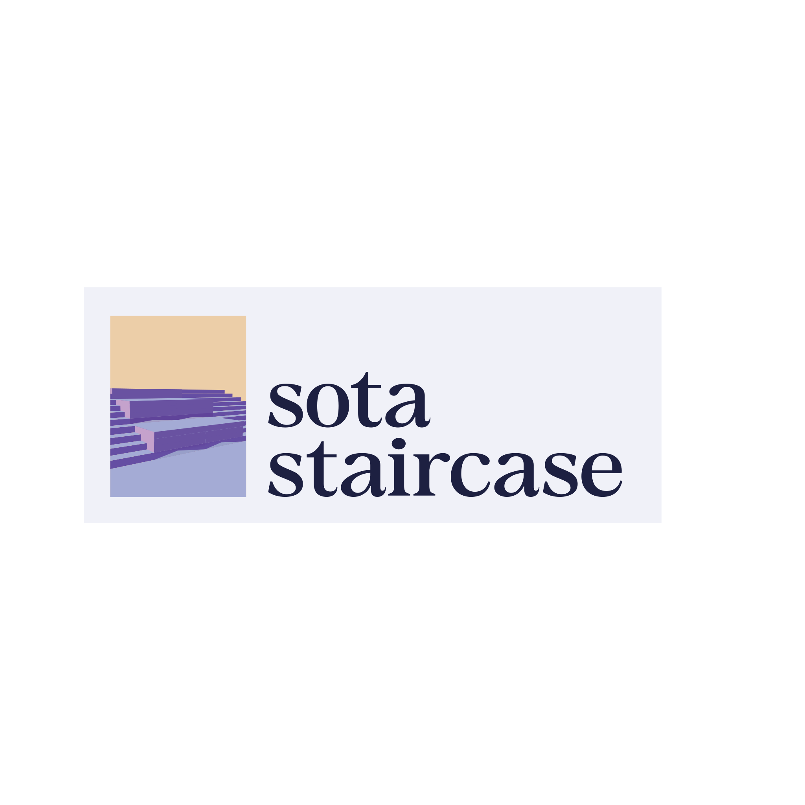
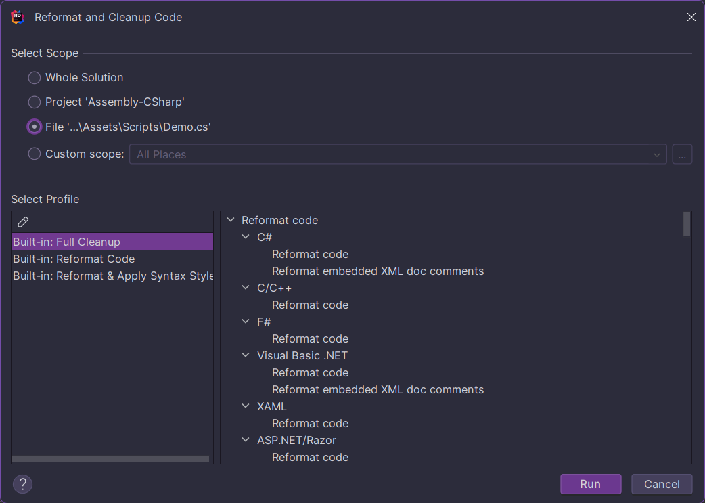

<p align="center" width="100%">
     
</p>

# The sota staircase Monorepository

Primary Repository: <https://forge.joshwel.co/mark/sota>  
Submission Mirror: <https://github.com/markjoshwel/sota>

| **Name** |         **Primary Role**        | **Secondary Role** |   **Forge**   |   **GitHub**   |
|:--------:|:-------------------------------:|:------------------:|:-------------:|:--------------:|
| mark     | creative and technical director | senior programmer  | @mark         | @markjoshwel   |
| ryan     | programmer                      | generalist         | @ryan         | @sc0rch-thinks |
| sai      | lead 3d artist                  | quality checker    | @sai-thinks | @sippy-thinks    |

- [Handbook](#handbook)
  - [on 3D Modelling (Maya, Blender, ZBrush, etc.)](#on-3d-modelling-maya-blender-zbrush-etc)
  - [on Graphic and UI/UX Design](#on-graphic-and-uiux-design)
  - [on Game Development](#on-game-development)
  - [on Game and Level Design](#on-game-and-level-design)
  - [on Documentation (for All Modules)](#on-documentation-for-all-modules)
  - [on Repository Syncing](#on-repository-syncing)
- [Licence and Credits](#licence-and-credits)
  - [Third-party Licences](#third-party-licences)

## Handbook

### on 3D Modelling (Maya, Blender, ZBrush, etc.)

| Lead | Sai  |
| :--: | :--: |

design-as-in-modelling your assets with modularity in mind, anything that can
be modular should be modular

design-as-in-look should be checked with the group 

structure your files similarly:

```text
Modelling
├── Sources
│   ├── <Asset Name>.blend
│   └── <Asset Name> (Maya Project Directory)
│       ├── ...
│       └── workspace.mel
├── Textures
│   └── <Asset Name>
│       ├── *.png
│       └── ...
├── Modulars
│   ├── <Asset Name>_lowpoly
│   └── <Asset Name>_highpoly
└── Heros
    ├── <Asset Name>_lowpoly
    │   └── *.fbx
    └── <Asset Name>_highpoly
```

### on Graphic and UI/UX Design

| Lead | Mark |
| :--: | :--: |

if it involves the brand: follow the brand guidelines at [Documents/sota staircase Brand Guidelines.pdf](Documents/sota%20staircase%20Brand%20Guidelines.pdf)

and then send it to mark for approval (●'◡'●)

anything that can be saved locally (including figma files, btw) _should_ be saved
locally, and then pushed to the forge under `Design/`

organise as you wish but make sure it's logical

### on Game Development

| Lead | Mark |
| :--: | :--: |

1. make changes

2. make sure the language checker isn't nagging you  
   (spelling and grammatical errors)

3. make sure intellisense isn't nagging you  
   (variable/class naming conventions, etc.)

4. reformat using rider's **Reformat and Cleanup Code** function,
   using the **Built-in: Full Cleanup** profile

   

5. push **to the forge**, or branch off and make a pull request if there's conflicts

### on Game and Level Design

| Lead | kinda everyone moreso mark |
| :--: | :------------------------: |

this just discuss with the group; either through the telegram group or through an issue
on [the forge](https://forge.joshwel.co/mark/sota/issues)

### on Documentation (for All Modules)

| Lead | kinda everyone moreso mark |
| :--: | :------------------------: |

follow the brand guidelines at [Documents/sota staircase Brand Guidelines.pdf](Documents/sota%20staircase%20Brand%20Guidelines.pdf)

source files (.docx, .fig, etc) should be in the respective modules' directory,
and then exported as .pdfs to `Documentation/*.pdf`

### on Repository Syncing

| Wizard | Mark |
| :----: | :--: |

TODO ☆\*: .｡. o(≧▽≦)o .｡.:\*☆

tentative instructions:

1. ensure your repo is up-to-date with the forge

    ```text
    git push origin main
    ```

    ```text
    git pull origin main
    ```

    if you have issues syncing, fix em first

2. run the sync script

    ```text
    python sync.py
    ```

    for what the script does, see the script itself: [sync.py](sync.py)

## Licence and Credits

Software Source Code, unless otherwise stated, is licenced under the 0BSD licence.
For more information, see [LICENCE.0BSD](LICENCE.0BSD).

Everything else, from assets to documentation, unless otherwise stated,
is licenced under a Modified Unsplash Licence.
For more information, see [LICENCE.UNSPLASH](LICENCE.UNSPLASH).

### Third-party Licences

Exceptions to the above licences are as follows:

> Template:
> ```
> - `path/to/file`: (Asset/Work Name) by (Author Name)  
>   (Licence Name)
> ```
> Example:
>
> - `Game/Assets/Character/Frogman`: Frogman by Frog Creator  
>   Standard Unity Asset Store EULA (Extension Asset)
